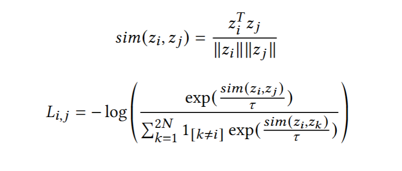
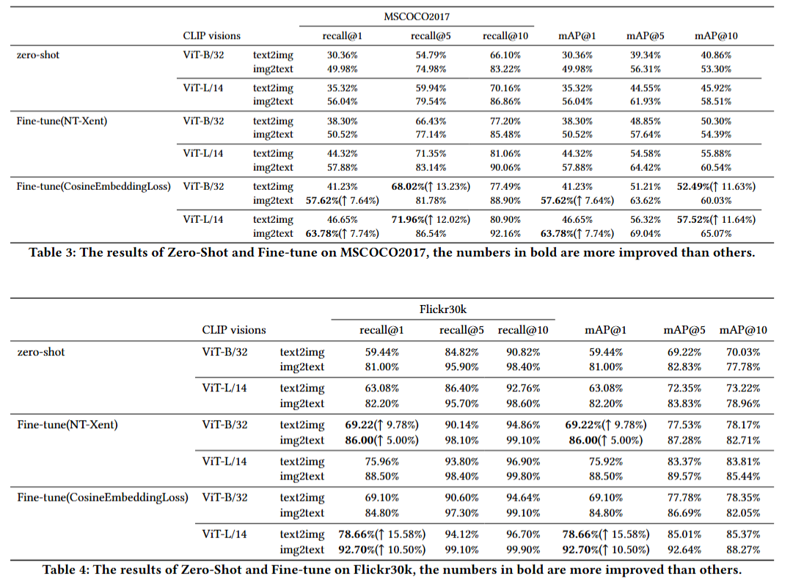

# Clip_crossmodal_retrieval

The main objective of this project is to set up a crossmodal retrieval (txt2img and img2txt) experiment exploiting the CLIP encoded features from MSCOCO and Flickr30k（or finetune on your own dataset). 

OpenAI’s CLIP (Contrastive Language–Image Pre-training) a Vision-and-Language Transformer (ViLT), a dual-encoder network pre-trained on a corpus of 400 million (image, text) pairs collected from a variety of publicly available sources on the Internet.  It is trained using a Contrastive Loss that takes as input paired text and image embeddings and tries to bring similar pairs closer together and push away dissimilar ones.

# The Main Idea

The loss function of CLIP is based on the average similarity of image-to-text (img2text) and text-to-image (text2img) which is computed below:



However, we introduce a modification by applying normalized temperature scaling to the similarity measurements. The temperature(τ) is set to 0.07 as initial value, an empirical value also utilized in CLIP pretraining. Crucially, we have made this temperature parameter trainable, find the most suitable temperature in the batch. Temperature adjustment sharpens the probability distribution, thereby focusing more precisely on the most probable pair.

Here, we employ a similarity contrastive loss function that directly drives the similarity of correct image-text pairs closer to 1.


This modified version departs from the traditional use of Euclidean distance. Instead, we have adopted cosine similarity as the metric for comparison, which has demonstrated a superior fit for our specific task.
Additionally, this approach is less constrained by batch size and computational resources, making it more efficient and adaptable in various scenarios. This inherent design feature enhances the model’s capability to perform retrieval tasks effectively, aligning closely with the needs of information retrieval in diverse contexts

This modification is more suitable for **smaller batch sizes** and is no longer affected by **temperature** parameters or **resource** constraints.

## Hardware and Training Details

| **Parameter**   | **Value**         |
|-----------------|-------------------|
| GPU             | NVIDIA Tesla P100 |
| Batch Size      | 32                |

Meanwhile, we freeze and store the other parameters of the model, training only the final layer, achieving high accuracy with rapid speed and limited resources.

And here is the result:


To use the code straightly, try:
```python
!pip install git+https://github.com/openai/CLIP.git
!git clone https://github.com/hxhhxx/Clip_crossmodal_retrieval.git
!pip install pycocotools
!python /kaggle/working/Clip_crossmodal_retrieval/main.py --batch_size "256" --trainable "adaptor"   --dataset "coco" --num_epoch "1" --model "ViT-L/14" # finetune defaultly, if just eval change the
```